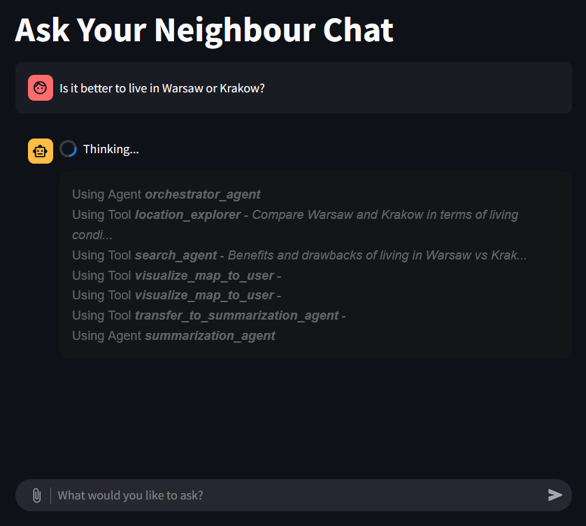
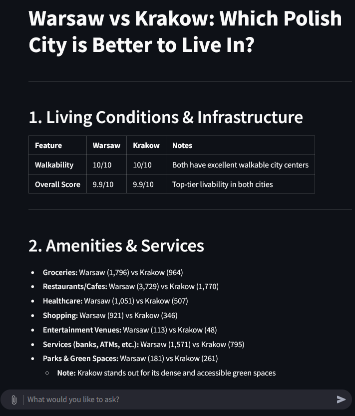
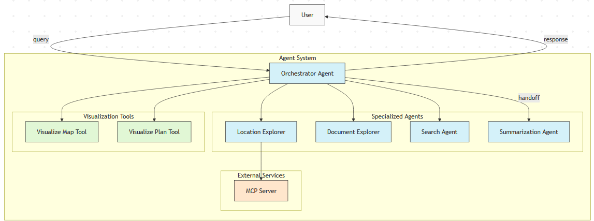

# Ask Your Neighbour

A simple chat interface for complex multi-agent system that performs deep research that help user find the best place to live.

You can ask any question in it using natural language in chatbot-like manner:


And get deep-research results based on gathered data:


For more features & use-cases, refer to [Features & Use Cases](docs/features.md)

## Project context
This project was done during the `AI Tinkerers - Warsaw Hackathon` on 2025.04.25-26.

> “Ask Your Neighbour” is an intelligent multi-agent system designed to help people explore and evaluate neighbourhoods in Poland without focusing on specific real estate listings. The tool empowers users to make informed decisions by synthesizing data from maps, regulations, and local sentiment.

> ### Problem Solved
> Searching for a new home can feel overwhelming: there’s plenty of data out there, but the tools to navigate it are either outdated and overloaded with confusing options, or so bare-bones that you don’t even know where to begin.
>
> With Ask Your Neighbour, we’ve eliminated the clutter and uncertainty—our intelligent, multi-agent system distills maps, regulations, and local sentiment into clear insights, so choosing the right Polish neighbourhood is finally effortless.

### The team
Our team is titled `RuntimeError`. 

## The design
The demo app was made as a simple chat in `streamlit`, however under the hood it makes use of a complex system of agents utilizing [OpenAI Agents SDK](https://openai.github.io/openai-agents-python/).

Agents architecture



## Setup

1. Install dependencies:
   ```
   uv sync
   ```

2. Set up environment variable - create a `.env` file in the root directory based on `.env.example`

## Run MCP Servers

To run the MCP servers, use the following command:

```bash
docker compose -f containers/docker-compose.yaml -p mcp-servers up --build
```

## Running the Chat App

To start the Streamlit chat application:

```
uv run streamlit run src/streamlit_app.py
```

The app will open in your default web browser at http://localhost:8501.
