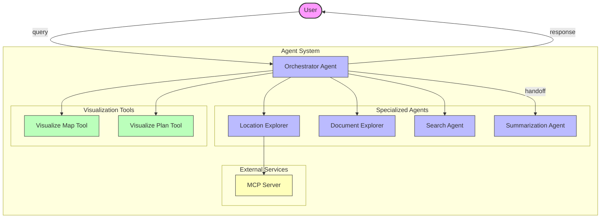

```mermaid
flowchart TD
    User([User])
    
    subgraph "Agent System"
        Orchestrator["Orchestrator Agent"]
        
        subgraph "Specialized Agents"
            Location["Location Explorer"]
            Document["Document Explorer"]
            Search["Search Agent"]
            Summarization["Summarization Agent"]
        end
        
        subgraph "Visualization Tools"
            VisMap["Visualize Map Tool"]
            VisPlan["Visualize Plan Tool"]
        end
        
        subgraph "External Services"
            MCP["MCP Server"]
        end
    end
    
    %% Connect components
    User -->|"query"| Orchestrator
    Orchestrator --> Location
    Orchestrator --> Document
    Orchestrator --> Search
    Orchestrator -->|"handoff"| Summarization
    
    %% Tools connections
    Orchestrator --> VisMap
    Orchestrator --> VisPlan
    
    %% Service connections
    Location --> MCP
    
    %% Response flow
    Orchestrator -->|"response"| User

    %% Styling
    classDef user fill:#f9f,stroke:#333,stroke-width:2px
    classDef agent fill:#bbf,stroke:#333,stroke-width:1px
    classDef tool fill:#bfb,stroke:#333,stroke-width:1px
    classDef service fill:#ffb,stroke:#333,stroke-width:1px
    
    class User user
    class Orchestrator,Location,Document,Search,Summarization agent
    class VisMap,VisPlan tool
    class MCP service
``` 