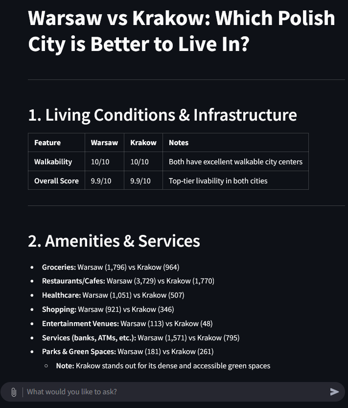
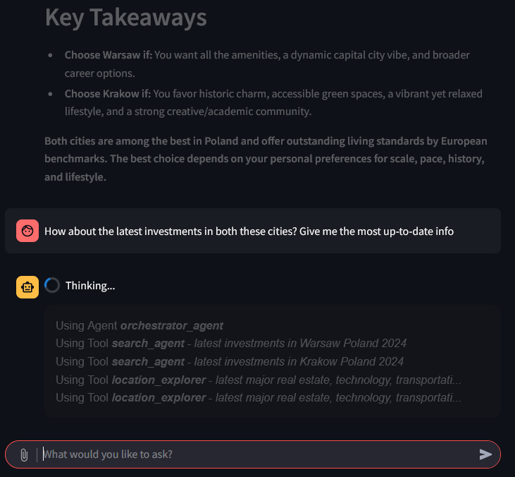
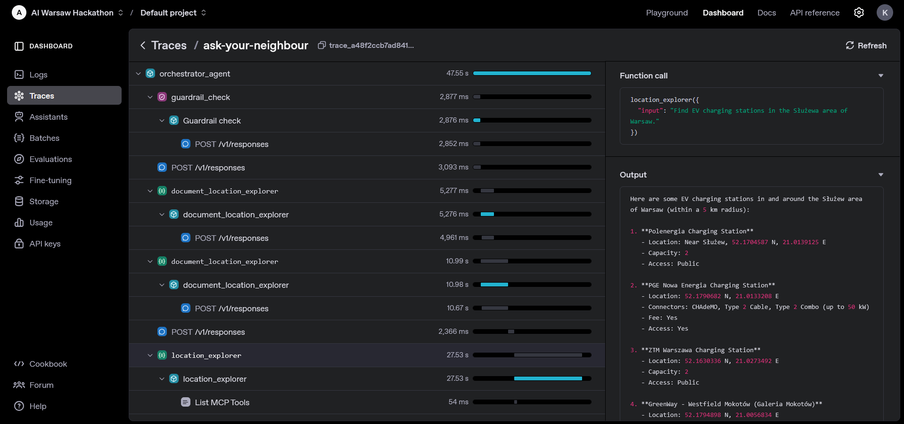

# Features & Use cases

## Querying
You can ask any question in it using natural language in chatbot-like manner:

and see the activation of various agents controlled by the orchestrator.

## Results
After some time (deep-research requires patience!) you can checkout the results:

⬇️⬇️⬇️

## Follow-up questions
You can add follow-up questions and refer to the previous messages:

## File analysis
One of the use-cases is analysis of complex documents refering to the plans
or some government decisions about your potential neighbourhood

⬇️⬇️⬇️

⬇️⬇️⬇️

## Multiagent architecture magic
One of the greatest advantages of this solution is possibility to mix 
data sources and synthesising them thanks to multi-agent architecture.

On this screnshot there is a moment captured when multiple different agents
are synchronized to answer the question. 

One can also peek the comunication between the agents on openai platform.

